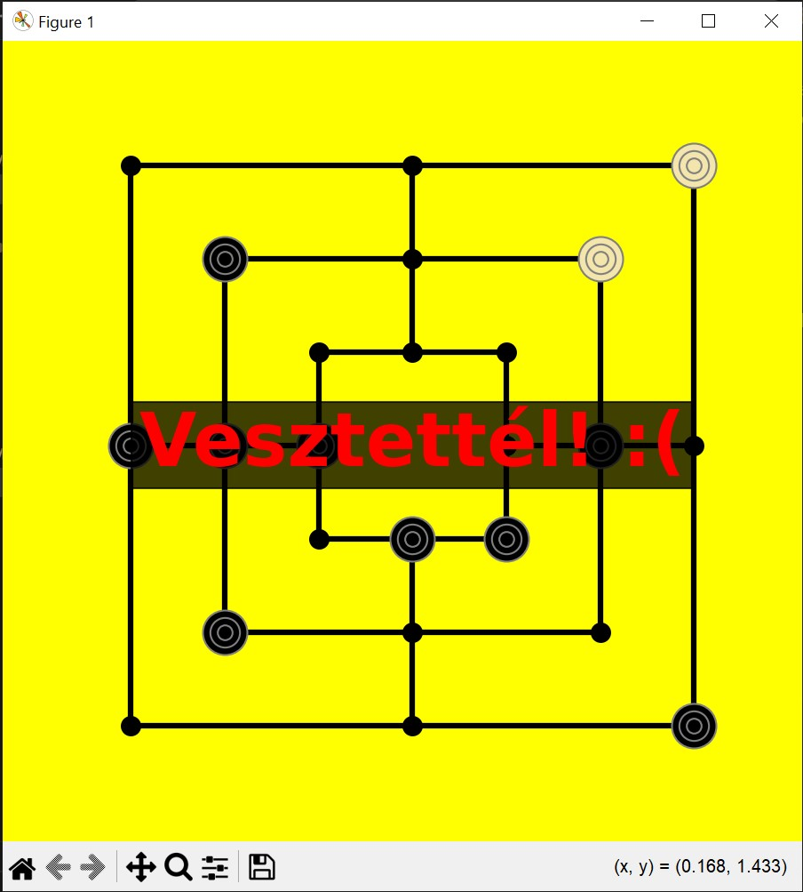

# Malom

Projektünkben a közismert malom játékot valósítottuk meg python programozási nyelv segítségével.

## Játékszabály
A malom játékot két játékos játsza, az egyik a fekete, a másik a fehér bábukkal van. A tábla így néz ki:


Minden játékosnak az a célja, hogy a táblán három, egy egyenesen lévő csomópontot elfoglaljon a saját bábuival. Ha ez megtörténik, a játékos levehet egy bábut az ellenféltől. A játéknak három szakasza van. Az első szakaszban a játékosok felváltva lerakják az összes bábujukat. A második szakaszban a játékosok felváltva lépnek egyet-egyet. Lépni csak szomszédos csomópontra lehet. Amikor valakinek mindössze három bábuja marad, elkezdődik számára a harmadik szakasz. Ekkor a játékos már nemcsak szomszédos csomópontra léphat, hanem bármely üres csomópontra átugorhat. A játéknak akkor van vége, ha valakinek csak kettő bábuja marad. A másik fél nyer.
Megjegyzés: a malomban használatos kifejezés a csikicsuki, ami egy olyan elhelyezkedést jelöl, melyben az egyik játékos az egyik bábuját úgy tudja mozgatni, hogy minden lépésében malmot fejez be vele. Például az alábbi ábrán a fehér játékosnak van egy csikicsukija:


(A játékszabály részletesebb leírása: http://mek.niif.hu/00000/00056/html/135.htm)

## A program futtatása
A feltöltött "malom.py" fájlban található a kód. 
A játék során a tábla csomópontjaira mindig koordinátákkal tudunk hivatkozni. Ezeket a koordinátákat minden esetben vesszővel elválasztva, zárójel nélkül kell beírni, (például: 1,1). A tábla közepe az origó, a 0,0. A játékban szereplő csomópontok koordinátái az origóhoz képest határozhatóak meg. A csomópontok koordinátái rendre: -3,3; 0,3; 3,3; -2,2; 0,2; 2,2; -1,1; 0,1; 1,1; -3,0; -2,0; -1,0; 1,0; 2,0; 3,0; -1,-1; 0,-1; 1,-1; -2,-2; 0,-2; 2,-2; -3,-3; 0,-3; 3,-3.
A kódban a play_game függvényben be tudjuk állítani azt, hogy fejenként hány bábu legyen a játékban:

```python
   def play_game(self): # Lejátszatja a játékot
        self.draw_board()
        for i in range(18): # 9-9 placing
            self.place_piece(self.turn)
        while self.player_pieces >= 3 and self.ai_pieces >= 3: # Lépnek, amíg több mint 3 bábujuk van, ha csak 3, akkor ugranak
            if self.turn == "Player":
                if self.player_pieces > 3:
                    self.move_piece(self.turn)
                else:
                    self.fly_piece(self.turn)
            else:
                if self.ai_pieces > 3:
                    self.move_piece(self.turn)
                else:
                    self.fly_piece(self.turn)
        self.game_over()
```
A játékban mi játszunk a fehér bábukkal, a gép a feketékkel. A gépre a továbbiakban AI-ként fogunk hivatkozni. A program futtatásakor először megjelenik az üres tábla. (lásd az első képet)
Ezt be kell zárnunk ahhoz, hogy az első lépésre felszólítást kapjunk.

```shell
Pozíció (pl. 1,1):
```
Ide azokat a koordinátákat kell beírni, ahova a bábut tenni szeretnénk.

```shell
Pozíció (pl. 1,1): 3,3
```
A lépésünk ezután meg is jelenik:


A táblát a felugró ablakban be kell zárnunk, majd újra megjelenik magától, már az AI lépésével együtt.


A játék során bármikor ha olyan koordinátát írunk, ami valami miatt nem lehetséges, akkor ezt az üzenetet írja a program:

```shell
Ezt nem lehet! Próbáld újra!
Pozíció (pl. 1,1):
```
Ha sikerül malmot raknunk, akkor rá fog kérdezni a program, hogy az AI melyik bábuját szeretnénk eltávolítani. Ekkor ugyanúgy koordinátákkal tudunk válaszolni. Amikor már a lépés fázisban vagyunk, akkor egy lépés során a mozgatandó bábu helyét és az új helyet is meg kell adnunk koordinátákkal. Ugyanígy az ugrálásnál is. Például:
```shell
Mozgatandó bábu: 1,-1
Új pozíció: 1,0
```
Hogyha valamelyik játékosnak már csak két bábuja marad, akkor véget ér a játék és a program kiírja, hogy nyertél vagy vesztettél:





## Az AI stratégiája
Az AI stratégiája minden fázisban prioritási listákat követ. Az AI ellenfelét a továbbiakban player-nek nevezzük.
A prioritási listák úgy működnek, hogy először az első pontot próbálja csinálni az AI, ha azt nem lehet, akkor lép a másodikra és így tovább. Ezáltal minden fázisban a legjobb lehetséges lépést teszi meg. A prioritási listákat a projekt keretein belül önállóan határoztuk meg.

Lerakó stratégia prioritási listája:
- az AI befejezi a saját malmát a harmadik bábu lerakásával
- az AI a player két, egy sorban lévő bábuja mellé rak egy harmadikat, megakadályozva ezzel a malom létrehozását
- az AI blokkolja a player diagonális stratégiáját
- az AI saját diagonális stratégiája szerint rak
- az AI elkezd egy lehetséges malmot (második bábut rak egy meglévő mellé olyan helyen, ahol van három szabad hely)
- az AI random lép

Lépő stratégia prioritási listája:
- az AI befejezi a saját malmát egy lépéssel
- az AI megakadályozza a player malmát egy lépéssel
- az AI csikicsukit hoz létre
- az AI potenciális malomra törekszik
- az AI megnyitja az egyik malmát
- az AI random lép

Ugráló stratégia prioritási listája:
- az AI saját malmot hoz létre
- az AI blokkolja a player malmát
- az AI elkezd vagy folytat egy malmot
- az AI random ugrik

Levevő stratégia prioritási listája:
- az AI a player csikicsukijából vesz le
- az AI a player lehetséges (könnyen befejezhető) malmából vesz le, azaz olyan vonalból, ahol már van két bábuja a playernek
- az AI a saját lehetséges malmát blokkoló player-bábut veszi le
- az AI azokból vesz le egyet, akiknek a legtöbb saját színű szomszédjuk van (mert ott, ahol sok bábuja van egy kupacban a playernek, nagyobb a valószínűsége a malomnak)


